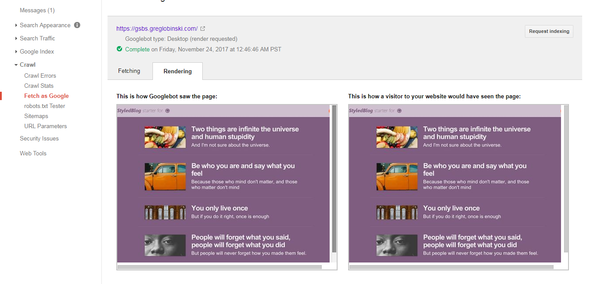

# StyledBlog starter for Gatsby

[DEMO website](https://gsbs.greglobinski.com/)


This is a starter/theme for [Gatsby](https://github.com/gatsbyjs/gatsby).

## Description

The goal is to make a theme for Gatsby which will look like an app. I use the
starter for my own [blog](https://www.userexperiencenotes.com/).

### No webfonts

I did it first time for many years. I created a website front-end with using no
webfonts. The StyledBlog uses only system fonts. So the typography looks a litle
different on different devices. This is the whole font setting
`/src/styles/global.js`

```
body {
    font-family: "-apple-system", "BlinkMacSystemFont", "Segoe UI", "Roboto","Oxygen", "Ubuntu", "Cantarell", "Fira Sans", "Droid Sans", "Helvetica Neue", "sans-serif";
  }
```

That's all. And it looks great. The inspiration came from
[reactjs.org](https://reactjs.org/). But, if you need them, I mean webfonts,
it's easy to add, take a look at the Customization section below.

### styled-components

StyledBlog uses [styled-components](https://www.styled-components.com/) and
[gatsby-plugin-styled-components](https://www.gatsbyjs.org/packages/gatsby-plugin-styled-components/).
Three important files to notice: `/src/styles/global.js` with global styles,
`/src/styles/colors.js` with color palette variables and `/src/styles/theme.js`
with a styled-component theme.

## Setup

If you are completely new to Gatsby, start with one of its
[official blog starters](https://www.gatsbyjs.org/docs/gatsby-starters/). If you
have already went through with the
[tutorials](https://www.gatsbyjs.org/tutorial/) install the starter like any
other one using `gatsby new` command.

```
gatsby new [NEW_SITE_DIRECTORY_FOR_YOUR_BLOG] git@github.com:greglobinski/gatsby-styled-blog-starter.git
```

## Customization

### Website data

Edit `\src\utils\siteConfig.js`

```
module.exports = {
  pathPrefix: "/",
  siteTitle: "Gatsby StyledBlog starter",
  siteLongTitle: "Gatsby StyledBlog Theme/Starter",
  siteUrl: "https://gsbs.greglobinski.com",
  siteLanguage: "en",
  siteLogo: "/logos/logo-1024.png",
  siteDescription: "This is a starter/theme for GatsbyJS",
  // manifest.json
  manifestName: "StyledBlog Gatsby starter",
  manifestShortName: "StyledBlog",
  manifestStartUrl: "/",
  manifestBackgroundColor: colors.first,
  manifestThemeColor: colors.firstLight,
  manifestDisplay: "standalone",
  // Author note
  authorName: "Mr. Gatsby",
  authorDescription: `Proin ornare ligula eu tellus tempus elementum. Aenean bibendum iaculis mi, nec blandit lacus interdum vitae. Vestibulum non nibh risus, a scelerisque purus. `,
  // texts
  copyright:
    "This is the place for a copyrigh note - editable through config object"
};
```

### Color palette

Edit the `\src\styles\colors.js` file to customize the color palette.

```
module.exports = {
  first: "#7F5D80",
  firstLight: "#CFC0CF",
  firstSuperLight: "#F4F0F4",
  firstDark: "#563E57",
  accent: "#FF6633",
  bright: "#ffffff",
  light: "#f3f3f3",
  middle: "#666666",
  dark: "#333333",
  superDark: "#111111"
};
```

### Theme

Edit the `\src\styles\theme.js` file to customize colors of element.

```
const colors = require("./colors");

const theme = {
  navigator: {
    colors: {
      title: colors.firstSuperLight,
      subTitle: colors.bright,
      scrollTrack: colors.first,
      scrollThumb: colors.firstDark,
      linkHover: colors.bright,
      header: colors.firstSuperLight,
      asideItemActiveBorder: colors.accent
    },
    sizes: {
      asideWidth: "19em",
      maxWidth: "56em"
    },
    backgrounds: {
      wrapper: colors.first,
      asideItemActive: colors.firstDark
    }
  },
  post: {
    colors: {
      author: colors.middle,
      authorBorder: colors.firstLight,
      bold: colors.middle,
      blockquoteFrame: colors.light,
      copyright: colors.middle,
      link: colors.first,
      linkHover: colors.firstLight,
      meta: colors.middle,
      metaBorder: colors.first,
      text: colors.dark,
      title: colors.middle,
      subTitle: colors.superDark
    },
    backgrounds: {
      wrapper: colors.bright,
      meta: colors.light
    },
    sizes: {
      maxWidth: "50em"
    }
  },
  bottomBar: {
    colors: {
      link: colors.bright,
      icon: colors.firstSuperLight
    },
    backgrounds: {
      wrapper: colors.first,
      icon: colors.firstDark
    },
    sizes: {
      height: 44 //pixels
    }
  },
  topBar: {
    colors: {
      link: colors.bright,
      linkPost: colors.first
    },
    backgrounds: {
      wrapper: colors.firstLight,
      wrapperPost: colors.bright,
      icon: colors.accent
    },
    sizes: {
      height: 44 //pixels
    }
  },
  info: {
    colors: {
      text: colors.firstDark,
      link: colors.firstDark,
      linkHover: colors.first,
      btn: colors.bright
    },
    backgrounds: {
      wrapper: colors.firstLight,
      btn: colors.accent
    },
    sizes: {
      maxWidth: "40em"
    }
  },
  mediaQueryTresholds: {
    XL: "65em",
    L: "49em",
    M: "37em",
    S: "28em",
    XS: "21em"
  }
};
```

### Webfonts

As I mentioned above StyledBlog does not use webfonts. If you need them, the
simplest way is to use Google Fonts through
[Typography.js](https://kyleamathews.github.io/typography.js/). But instead
installing Typography.js directly use
[gatsby-plugin-typography](https://www.gatsbyjs.org/tutorial/part-two/#typographyjs).

Remember to update `body { font-family: ....}` in the `/src/styles/global.js`
file. Remove also `import "normalize.css";` from `/src/layouts/index.js`,
Typography comes with its own normalize styles.

### Posts

Content of the blog is located in the `/content/posts/` directory in markdown
files.

# Status

I like the approach described in the saying "Do it, then do it right and then do
it even better." So...

### What was done

I started with
[gatsby-starter-hello-world](https://github.com/gatsbyjs/gatsby-starter-hello-world).

Then installed some Gatsby plugins: gatsby-image, gatsby-plugin-catch-links,
gatsby-plugin-manifest, gatsby-plugin-netlify, gatsby-plugin-offline,
gatsby-plugin-react-helmet, gatsby-plugin-sharp,
gatsby-plugin-styled-components, gatsby-plugin-typography,
gatsby-remark-copy-linked-files, gatsby-remark-images, gatsby-remark-prismjs,
gatsby-remark-responsive-ifram, gatsby-remark-smartypants,
gatsby-source-filesystem, gatsby-transformer-remark, gatsby-transformer-sharp

And a couple of other packages: normalize.css, styled-components

Finaly created four React components: Navigator, TopBar, BottomBar and Info.
There are also other comonents, but they are only for code organizing.

### What need to be done to 'Do it right'

* Fix bugs
* Add redux (react-redux) to manage state of interface
* Types (prop-types/?/flow)
* Navigator virtualization
* Refactor animations for mobile
* Categories
* SEO component
* Disqus Comments
* ...

### What can be done to "make it even better"

* Searching
* PWA push notifications (?)
* Localstorage for user history
* ...

# Bugs

### No JavaScript empty home page

The _Navigator_ component is a child of main layout component. The main layout
component gets _posts_ data through callback function from
`/src/pages/index.js`. Because of that, when JavaScript in the user's web
browser is off and the user visits the home page he sees the TopBar only, there
is no a list of posts. It will be fixed after I implement redux. It's not
connected, but redux implementation is on the go, there are already Containers
components.

The bug is real, but it's not as critical as I thought. Yeah, it hits no JS
users, but from the SEO point there is no problem. Googlebog see the home page
properly.



### Outline focus

I wanted to use [what-input](https://github.com/ten1seven/what-input) package to
suppress focus outline on buttons and links when a user uses a mouse. But for
now the package breaks `gatsby build` process. So, first I will send a fix pull
request to the package repo.

# Updates

If you are interested in updates follow me at
[@greglobinski](https://twitter.com/greglobinski).
